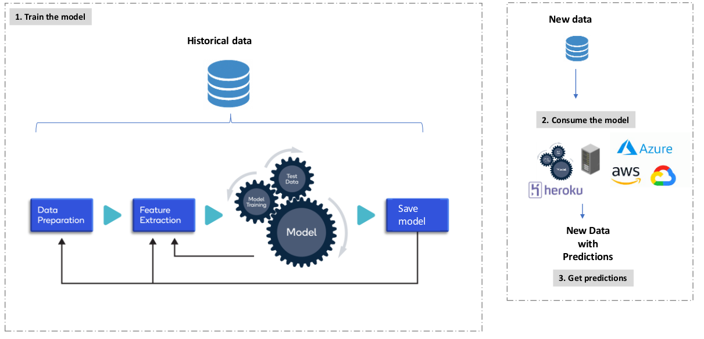

# MLOps Azure

Deploy to Azure Cloud

## Overview

### Architecture



### Azure Container Registry


### Container deployment 


## Azure CLI

### Install

https://learn.microsoft.com/pt-br/cli/azure/install-azure-cli-linux?pivots=apt


```sh
curl -sL https://aka.ms/InstallAzureCLIDeb | sudo bash
```

```sh
az loging
```

### Push to Azure Container

```sh
docker login -u mlops-token marketminingpycaret3.azurecr.io
docker login -u marketminingpycaret3 marketminingpycaret3.azurecr.io
```

```sh
docker push marketminingpycaret3/samples/hello-world
```

## References

- 